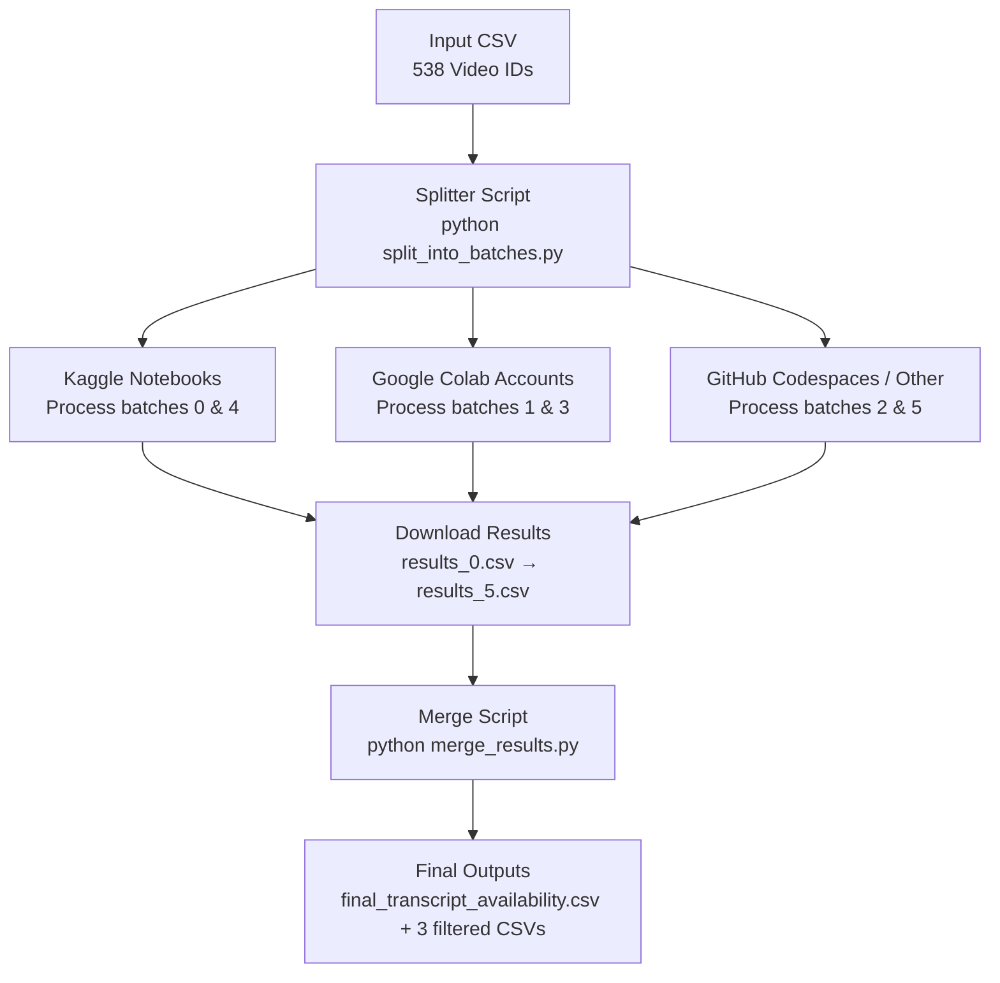

I am documenting all code links here,,,,,,
# Think Monkey Think!
1. in an excel file we listed only the video links and generes..
``` This format ``` [here](https://docs.google.com/spreadsheets/d/1r1_HG36UNB_sjXxdKvOh2n14nsvXkRmH3ni1yjCNUeA/edit?gid=0#gid=0)

2. We export it to kaggle...use our API and [this code](https://www.kaggle.com/code/sanjidh090/gembox) to get a file like this one in Bayazid's [doc](https://docs.google.com/spreadsheets/d/1apua3GW4galTPbofVIXvaZa9yeL0jUMsWw2aeUda4v4/edit?gid=328040953#gid=328040953)

[Note]: Not all videoes are here. There are two extra parts such as one for audiobooks and one for debates talkshows etc
Found the audio part here [audio-book-pipeline](https://www.kaggle.com/code/sanjidx/audio-book-pipeline/notebook) \
```Note: Only video ids are good enough for scrapping```\
This script probably be the strongest one needed...Earlier one part was collected manually this part makes it scalable....just find good channels we will evaluate it, Might make it even better with yt-dlp automating

Need to find the talkshow one,too......\
<This code here deserves a bit of idk what is it....Call it fallen ...[star](https://www.kaggle.com/code/sanjidx/notebookbdc8160fa6/notebook)...might use it later. Alse this one [here](https://www.kaggle.com/code/sanjidx/notebook22185afc93/edit)...Used it to create a metadata....However good code creates good code...we will save it >


Now about the talkshow part...perhaps we need to find where is it.......
and I found it here [{target_500}](https://docs.google.com/spreadsheets/d/1zJriZ9Zxm3ffs3r4dll9f9TJ_q0buU3-aL_O93lzlCo/edit?gid=0#gid=0)

Collecting this is as simple as earliar,,,select a few news channels and make a search hehe!

Then comes my famous Ytranscript [repo](https://github.com/Sanjidx090/ytranscript).............\

### Complete Workflow

We selected only ```videos_with_bangla.csv``` files...as we had to work in batches, there are 4 in the repository. 

with the derived video id that has bangla transcript, we uploaded them to huggingface....Got their diarization by pyannote.api ..Code[cite : AHM FUAD]

also..This code was good for a lot of task such as downloading, chunking and adding noises to data . CODE [here](https://www.kaggle.com/code/rlsalvi/sanjid-zip-fix) \
Also, there were codes that has been used for preparing trainning data ```wheel.ipynb```

This code were used for uploading in huggingface by bulk [here](https://www.kaggle.com/code/sanjidx/bulk-shot-hf/edit)..saved a lot of time...........

I had a weird feeling that we might need ASR chunks separated and here is what I did to balance [that](https://www.kaggle.com/code/sanjidh090/notebookasr/edit)

Something I am missing? Yeah,.....A lot of struffles were on the way,,,didnot mention them.

Oh one thing,,,The process was not linear....we had to delete and add things...The codes won't simply create a dataset now.....For example we did diarization of files which only got bangla transcript. Now there came some issuw when we wanted transcription as well.It created a diversion. To manage that I had to make a new arrangement..There we were getting  
# rate limiting errors!

# Error we were seeing all the time....The reason behind all engineering we had to do\\\


I have a great news now...I successfully automated the process....not yet sure for the whole....but it's https://www.kaggle.com/code/sanjidh090/reproducable-lipighor/edit done for good!


Now.....again...Think monkey think...

How would you recrate and increase this work even further?
We actually made one big method to go ahead...make use one of the ```videoes_with_bangla.csv```
Put it into the script for Diarization.
Then for ASR....follow this script........if you get rate limit error. Please refresh...all you have to do is find video ids that have bangla transcript...we have introduced a way for that too!
